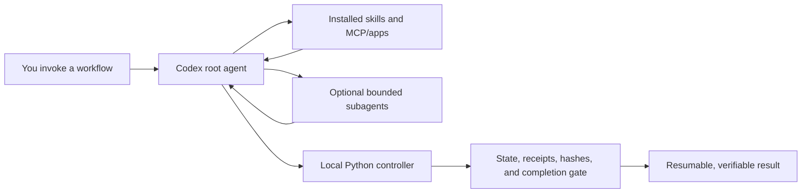

# Codex Agent Graphs

[English](README.md) | [Русский](README.ru.md)

> Turn recurring Codex work into resumable, bounded, evidence-backed workflows — without replacing Codex with another orchestrator.

**Start a project. Research a hard question. Deliver a software task. Improve a
repository.** Codex Agent Graphs packages those workflows as native Codex
skills. Small standard-library Python controllers are admitted only when work
needs durable state, evidence binding, resumability, or independent
verification.

- **Native to Codex:** skills, custom agents, `AGENTS.md`, MCP, and the root agent you already use.
- **Model-first:** Codex owns judgment, planning, research, implementation, and synthesis.
- **Deterministic where it matters:** scripts own paths, transitions, retry limits, receipts, hashes, and completion checks.
- **Adaptive, not agent-hungry:** the fast path stays single-agent; specialist agents appear only when scope or risk justifies them.
- **Pay only for the guarantee you need:** ordinary work can stay skill-only;
  tracked and verified execution are optional reliability tiers.
- **Portable:** one installer keeps WSL CLI and Codex Desktop copies in sync.

This is an independent community project, not an official OpenAI repository.

## What is included today

- **Adaptive execution tiers:** use a direct model-first loop for ordinary work,
  add durable tracking for long or delegated tasks, and admit independent
  verification only when the risk justifies it.
- **Context-safe Task Delivery:** persistent Markdown plans, bounded slice
  packets, worker receipts, root-owned diff and test verification, and compact
  checkpoints for work that crosses context windows.
- **Project foundation and maintenance:** canonical project maps, stack-specific
  engineering guidance, root and nested `AGENTS.md`, and focused documentation
  synchronization after implementation.
- **Autonomous bounded improvement:** inspect one evidence-backed candidate,
  return an honest no-op or issue-ready result, or hand accepted implementation
  to Task Delivery.
- **Shared artifact lifecycle:** preserve canonical outputs, compact terminal
  run state into verified archives and receipts, and prune only through an
  explicit dry-run-first retention policy.

## Why this exists

Powerful prompts are easy to write and hard to operate repeatedly. Long-running work tends to lose its boundaries: plans drift, evidence gets separated from claims, retries become loops, and “done” becomes a feeling.

Codex Agent Graphs adds a deliberately small control layer:

```text
work  ───────────────→  complete
  └── when risk requires it → verify ──┘
```

The graph does not tell the model how to think. It makes lifecycle, scope,
evidence, and completion explicit enough to resume and audit when those
guarantees are actually needed.

```text
skill-only  → one root loop, no durable controller run
tracked     → controller, scope/baseline, resumability and handoff
verified    → tracked execution plus independent exact-candidate review
```

## Choose your workflow

| Invoke | What it delivers | Best for |
| --- | --- | --- |
| `$project-start` | A canonical project foundation or a focused documentation-maintenance pass | New repositories, inherited codebases, and keeping `AGENTS.md` plus project docs aligned with reality |
| `$research` | Cited, decision-ready research that starts fast and deepens only when the evidence demands it | Technical investigation, comparisons, current facts, and high-confidence research reports |
| `$task-delivery` | One scoped software task from Markdown plan through implementation, tests, review, and handoff | Features, fixes, refactors, plan-only work, or implementation from an accepted plan |
| `$continuous-improvement` | One evidence-backed repository improvement or an honest no-op/issue-ready result | Bounded autonomous maintenance from a failing test, CI signal, regression, or explicit audit request |

Three supporting capabilities keep those workflows healthy:

| Capability | Role |
| --- | --- |
| `$agent-graph-builder` | Creates or standardizes graph-backed skills against the shared contract; it is a meta-skill, not another runtime workflow |
| `$development-recovery` | Recovers when specification, plan, code, tests, or observed behavior diverge; it is a conditional non-graph skill |
| Large-codebase discovery | A managed global policy that bounds repository exploration and joins the evidence before planning; it deliberately adds no new skill or graph |

## Quick start

### Requirements

- Codex CLI or Codex Desktop
- Python 3.11 or newer
- Git

Clone the repository and preview every change before installation:

```bash
git clone https://github.com/ArtemArzi/codex-agent-graphs.git
cd codex-agent-graphs
python3 scripts/install.py plan --wsl
```

Install into the local WSL/CLI Codex home and verify exact file hashes:

```bash
python3 scripts/install.py install --wsl
python3 scripts/install.py verify --wsl
```

### Claude Code (plugin install)

The same repository is a native Claude Code plugin — one shared source tree,
nothing generated at install time, nothing written outside the plugin cache:

```bash
claude plugin marketplace add ArtemArzi/codex-agent-graphs
# then inside a session:
#   /plugin install cag@codex-agent-graphs
#   /reload-plugins
# smoke test: /cag:research on a scratch repository
```

Skills arrive as `/cag:project-start`, `/cag:task-delivery`, `/cag:research`,
`/cag:continuous-improvement`, `/cag:development-recovery`,
`/cag:agent-graph-builder`, `/cag:dev-policies`. Agent roles arrive as
`cag:`-namespaced subagents generated from the canonical `agents/*.toml`
(`scripts/claude_agents_sync.py`; `check_all.py` fails if the projection ever
drifts). Uninstall with `/plugin uninstall cag` plus
`claude plugin marketplace remove codex-agent-graphs` — no other trace remains.

**Honest parity notes.**

- Codex enforces reviewer read-only mode at the OS sandbox level. Claude Code
  reviewers get `disallowedTools: Write, Edit, NotebookEdit` and an explicit
  tool allowlist — a reviewer keeping Bash can technically still write.
  Hash-linked receipts in the run state remain the post-hoc control; treat the
  verified tier accordingly.
- `web_search = disabled` maps to omitting WebSearch/WebFetch — a tool-level
  block, not a network-level one.
- **Lockstep rule:** the two hosts update through independent channels
  (`install.py` vs the plugin marketplace). After changing skills or graphs,
  refresh both installs before resuming a shared run; version skew fails loudly
  (`state.json` pins the graph version and hash) and corrupts nothing.
- **One harness per run directory at a time.** Shared state uses a lock file
  with liveness detection; a concurrent second harness fails loudly.

If you use Codex in WSL and Codex Desktop on Windows, install and verify both copies together:

```bash
python3 scripts/install.py plan --all
python3 scripts/install.py install --all
python3 scripts/install.py verify --all
```

The Desktop home is auto-detected when possible. Override either target explicitly when needed:

```bash
python3 scripts/install.py install \
  --wsl --wsl-home /path/to/wsl/.codex

python3 scripts/install.py install \
  --desktop --desktop-home /mnt/c/Users/you/.codex
```

Open a new CLI session or Desktop task after installation so Codex loads the new skills, policies, and agent configuration.

### Try the workflows

```text
$project-start prepare this existing repository for reliable agent development

$research compare the current approaches to local-first agent memory and give me a cited recommendation

$task-delivery add rate limiting to this API and prove the behavior with tests

$continuous-improvement inspect this repository and fix one proven low-risk issue

$agent-graph-builder turn our release checklist into a resumable graph-backed skill
```

Skills can also trigger implicitly when the request matches their description, but explicit invocation is the clearest way to select a workflow.

## What gets installed

The installer copies files; it does not create cross-filesystem symlinks.

| Installed surface | What changes |
| --- | --- |
| Skills | Six directories under each target Codex home: `agent-graph-builder`, `continuous-improvement`, `development-recovery`, `project-start`, `research`, and `task-delivery` |
| Shared runtime | `agent-graph-runtime/` under each target Codex home for deterministic artifact inventory, verified compaction, and explicit TTL pruning |
| Custom agents | Thirteen bounded role definitions for conditional exploration, implementation, planning review, result review, project-doc verification, improvement verification, and deep research |
| `config.toml` | One managed block that registers those custom roles without replacing unrelated configuration |
| Global `AGENTS.md` | Managed development-recovery and large-codebase-discovery policy blocks; unrelated instructions are preserved |

Before replacement, existing managed files are backed up under `backups/agent-graphs/`. Installation uses staged copies and finishes with manifest and SHA-256 verification. Drift is reported rather than silently overwritten.

## How the pieces work together



The root agent remains the sole orchestrator and final truth owner. Optional subagents receive narrow packets and stay leaf-only. The controller never calls a model API and never replaces semantic work with a state machine.

When the controller is admitted, all four operational graphs share the same
topology — `work → optional verify → complete` — while exposing different
modes:

- **Project Start:** `bootstrap`, `maintenance`, or automatic routing.
- **Research:** skill-only single-agent answers by default; tracked fast/deep
  work and independent verification are opt-in by evidence.
- **Task Delivery:** quick skill-only delivery by default; tracked
  `plan`/`implement`/`full` modes and verified risk profiles when needed.
- **Continuous Improvement:** `audit` or `full`, with one candidate maximum and Task Delivery owning accepted implementation.

## Artifact lifecycle

Canonical plans, reports, handoffs, decisions, and maintained documentation stay
at their project paths. Full run state remains untouched while work is active,
blocked, or awaiting implementation. After safe terminal completion, the shared
runtime can create one verified archive and one permanent compact receipt:

```text
.agent-graphs/history/<graph>/<run>/FINAL.json
.agent-graphs/archives/<graph>/<run>.tar.gz
```

Inventory and compaction do not delete raw state. Pruning is a dry-run unless
`--apply` is supplied, validates the archive and raw manifest again, never
follows symlinks, and never deletes canonical outputs. Successful raw state has
a seven-day default retention; its archive has thirty days. These values may be
overridden per repository in `.agent-graphs/retention.json`.

## Skills, plugins, and MCP

Codex Agent Graphs is currently distributed as a source repository with native skills and agent configuration. **It does not bundle or require a plugin package.** A plugin wrapper can become a later distribution layer; it is not part of the runtime architecture.

It also does not bundle an MCP server. A workflow discovers MCP only when it
needs external, provider, library, or live-system context and then prefers the
provider that owns the data. A tracked receipt records `mcp:<server>`, a checked
`mcp:fallback:<reason>`, or `mcp:not-applicable:<reason>` for local-only work.

Dependencies and companion capabilities are intentionally visible:

| Capability | Relationship |
| --- | --- |
| System `$skill-creator` | Required only when `$agent-graph-builder` scaffolds or restructures a graph skill |
| `domain-modeling` and `codebase-design` | Expected companion skills for the full Project Start bootstrap; they are not vendored by this repository |
| `setup-matt-pocock-skills` | Optional Project Start companion; an internal Project Start fallback is used when it is unavailable |
| Other installed skills, apps, and MCP servers | Selected adaptively inside `work` when the task actually needs them; they are not mandatory graph stages |

This follows Codex's native separation of concerns: [`AGENTS.md`](https://learn.chatgpt.com/docs/agent-configuration/agents-md) carries durable guidance, [skills](https://learn.chatgpt.com/docs/build-skills) package reusable workflows, [subagents](https://learn.chatgpt.com/docs/agent-configuration/subagents) handle bounded specialist work, [MCP](https://learn.chatgpt.com/docs/extend/mcp) connects external systems, and [plugins](https://learn.chatgpt.com/docs/plugins) package workflows and integrations for distribution.

## Inside each workflow

### Project Start

Project Start builds the working context that ordinary coding agents usually have to rediscover on every task. Bootstrap normalizes the documentation map, domain, business context, foundation, codebase, quality bar, implementation plan, and agent instructions. Maintenance classifies the exact documentation delta after delivery and updates only the affected layer.

Task Delivery completion can create a durable maintenance obligation, so the next task does not quietly proceed on stale project context.

### Research

Research starts skill-only with one native Codex agent and a bounded evidence
budget. It creates a tracked run only for resumability, persistent reports,
durable evidence or verification. Deep mode can use focused scouts and a
verifier, but agent count is a ceiling, not a target.

The deterministic gate binds the report to its sources and control artifact; it does not pretend to validate reasoning by re-running it in code.

### Task Delivery

Task Delivery owns one software task. Small local work stays quick and
skill-only. Tracked work finds the project's real plan owner, freezes outcome
and scope, implements against that plan, runs narrow and project-level checks,
and creates a handoff backed by exact digests. Review depth scales with actual
risk instead of the profile name alone.

Parallel write delegation is intentionally fail-closed until isolated worktrees can be proven.

### Agent Graph Builder

Agent Graph Builder layers graph-specific structure on top of the system `$skill-creator`. Its validator checks graph identity and versioning, the three-node topology, bounded retries, capability receipts, controller/test presence, model-free routing, and the division between model judgment and deterministic enforcement.

It is for repeated workflows that benefit from resumability, evidence handoffs, or conditional review — not for turning every prompt into a graph.

## Validate before you trust it

The repository gate uses only the Python standard library:

```bash
python3 scripts/check_all.py
```

It compiles controllers, validates TOML and skill structure, checks every
operational graph against the shared contract, and runs focused test suites for
installation, the shared artifact runtime, every operational graph, and Agent
Graph Builder.

For a release or local modification, run the complete gate:

```bash
python3 scripts/check_all.py
python3 scripts/install.py install --all
python3 scripts/install.py verify --all
git diff --check
```

## Design principles

1. **Keep judgment in the model.** Graphs constrain lifecycle and evidence, not reasoning.
2. **Make the fast path cheap.** Multi-agent depth is conditional.
3. **Bind claims to artifacts.** Receipts and SHA-256 digests make checkpoints inspectable.
4. **Fail closed on unsafe orchestration.** Bounds, ownership, and compatibility are enforced in code.
5. **Preserve user state.** Dirty work, installed configuration, and active legacy runs are treated as real constraints.
6. **Use one control plane.** Codex orchestrates; scripts never become a competing agent runtime.

## Repository map

```text
skills/       native skill instructions, graph contracts, references, and controllers
agents/       installable custom-agent role definitions
policies/     managed global AGENTS.md policies
agent-graph-runtime/ shared deterministic artifact lifecycle
scripts/      installer and repository-wide validation gate
tests/        installer and integration checks
```

Start with [`AGENTS.md`](AGENTS.md) for repository invariants, then read the relevant `skills/<name>/SKILL.md` and `graph.json`.

## Current boundaries

- Installation is built and tested for WSL CLI plus Codex Desktop homes; other host layouts may need an explicit path or installer adaptation.
- Companion skills named above are not vendored here.
- A Claude Code plugin/marketplace manifest is included (`.claude-plugin/`);
  Codex installation remains `scripts/install.py` and ignores it entirely.
- This repository currently has no declared open-source license. Public visibility lets you inspect and evaluate the work, but it is not an open-source grant.

Issues and focused pull requests are welcome, especially when they include a reproducible workflow failure, a controller test, or a concrete portability improvement.
