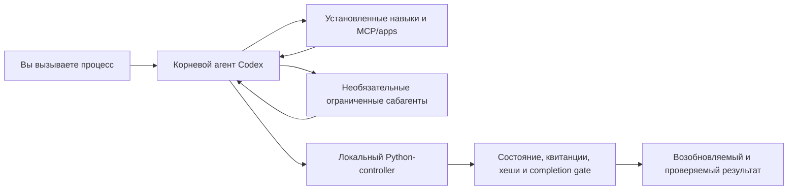

# Codex Agent Graphs

[English](README.md) | [Русский](README.ru.md)

> Превращает повторяющуюся работу в Codex в возобновляемые, ограниченные и
> подтверждённые доказательствами процессы — без замены Codex ещё одним
> оркестратором.

**Подготовить проект. Исследовать сложный вопрос. Довести программную задачу.
Улучшить репозиторий.** Codex Agent Graphs упаковывает эти процессы в нативные
навыки Codex. Небольшие Python-контроллеры только на стандартной библиотеке
подключаются тогда, когда работе действительно нужны долговечное состояние,
привязка доказательств, возобновление или независимая проверка.

- **Нативно для Codex:** навыки, специализированные агенты, `AGENTS.md`, MCP и
  уже знакомый корневой агент.
- **Сначала модель:** Codex отвечает за суждение, планирование, исследование,
  реализацию и итоговый синтез.
- **Детерминизм там, где он нужен:** скрипты контролируют пути, переходы,
  лимиты повторов, квитанции, хеши и условия завершения.
- **Адаптивность без армии агентов:** быстрый путь остаётся одноагентным;
  специалисты подключаются только при подходящем масштабе или риске.
- **Платите только за нужную гарантию:** обычная работа может идти только через
  навык; отслеживаемый и независимо проверяемый режимы включаются по потребности.
- **Переносимость:** один установщик синхронизирует Codex CLI в WSL и Codex
  Desktop.

Это независимый проект сообщества, а не официальный репозиторий OpenAI.

## Что входит сейчас

- **Адаптивные уровни исполнения:** прямой model-first цикл для обычной работы,
  долговечное отслеживание для длинных или делегированных задач и независимая
  проверка только при оправданном риске.
- **Task Delivery с сохранением контекста:** постоянные Markdown-планы,
  ограниченные slice-пакеты, квитанции воркеров, проверка diff и тестов корневым
  агентом и компактные checkpoints для работы через несколько контекстных окон.
- **Основание и поддержка проекта:** канонические карты проекта, инженерные
  правила конкретного стека, корневые и вложенные `AGENTS.md`, точечная
  синхронизация документации после реализации.
- **Ограниченное автономное улучшение:** проверить одного доказуемого кандидата,
  честно завершить без изменений, подготовить issue или передать принятую
  реализацию в Task Delivery.
- **Общий жизненный цикл артефактов:** сохранить канонические результаты,
  упаковать завершённое состояние в проверенный архив и квитанцию, а очистку
  выполнять только через явную dry-run-first политику хранения.

## Зачем это нужно

Сильный промпт написать легко, а стабильно применять его снова и снова —
сложно. В долгой работе стираются границы: план дрейфует, доказательства
отделяются от утверждений, повторные попытки превращаются в цикл, а готовность
результата определяется по ощущениям.

Codex Agent Graphs добавляет небольшой управляющий слой:

```text
work  ───────────────→  complete
  └── если этого требует риск → verify ──┘
```

Граф не объясняет модели, как думать. Он делает жизненный цикл, область работы,
доказательства и условие завершения достаточно явными, чтобы работу можно было
возобновить и проверить, когда такие гарантии действительно нужны.

```text
skill-only  → один корневой цикл без постоянного controller-run
tracked     → controller, scope/baseline, возобновление и handoff
verified    → tracked-исполнение плюс независимая проверка точного кандидата
```

## Выберите процесс

| Вызов | Что получает пользователь | Когда использовать |
| --- | --- | --- |
| `$project-start` | Каноническое основание проекта или точечный проход поддержки документации | Новый репозиторий, унаследованная кодовая база, синхронизация `AGENTS.md` и проектных документов с реальностью |
| `$research` | Исследование с источниками, готовое для принятия решения; быстрое по умолчанию и углубляющееся только при недостатке доказательств | Технические исследования, сравнения, текущие факты и отчёты с высокой уверенностью |
| `$task-delivery` | Одна ограниченная программная задача: от Markdown-плана до реализации, тестов, проверки и handoff | Функции, исправления, рефакторинг, режим только плана или реализация по принятому плану |
| `$continuous-improvement` | Одно подтверждённое улучшение репозитория либо честный no-op/issue-ready результат | Ограниченное автономное обслуживание по падающему тесту, CI-сигналу, регрессии или прямому запросу аудита |

Три вспомогательные возможности поддерживают эти процессы:

| Возможность | Роль |
| --- | --- |
| `$agent-graph-builder` | Создаёт или стандартизирует навыки с графом по общему контракту; это мета-навык, а не ещё один рабочий процесс |
| `$development-recovery` | Восстанавливает работу при расхождении спецификации, плана, кода, тестов или наблюдаемого поведения; это условный навык без собственного графа |
| Исследование большой кодовой базы | Глобальная управляемая политика, которая ограничивает разведку репозитория и объединяет доказательства до планирования; отдельный навык или граф намеренно не создаётся |

## Быстрый старт

### Требования

- Codex CLI или Codex Desktop
- Python 3.11 или новее
- Git

Клонируйте репозиторий и сначала посмотрите план установки:

```bash
git clone https://github.com/ArtemArzi/codex-agent-graphs.git
cd codex-agent-graphs
python3 scripts/install.py plan --wsl
```

Установите компоненты в локальный Codex home для WSL/CLI и проверьте точные
хеши файлов:

```bash
python3 scripts/install.py install --wsl
python3 scripts/install.py verify --wsl
```

Если вы используете Codex в WSL и Codex Desktop в Windows, установите и
проверьте обе копии вместе:

```bash
python3 scripts/install.py plan --all
python3 scripts/install.py install --all
python3 scripts/install.py verify --all
```

Codex Desktop home по возможности определяется автоматически. При
необходимости укажите любой путь явно:

```bash
python3 scripts/install.py install \
  --wsl --wsl-home /path/to/wsl/.codex

python3 scripts/install.py install \
  --desktop --desktop-home /mnt/c/Users/you/.codex
```

После установки откройте новую CLI-сессию или новую задачу в Desktop, чтобы
Codex загрузил навыки, политики и конфигурацию агентов.

### Попробуйте процессы

```text
$project-start prepare this existing repository for reliable agent development

$research compare the current approaches to local-first agent memory and give me a cited recommendation

$task-delivery add rate limiting to this API and prove the behavior with tests

$continuous-improvement inspect this repository and fix one proven low-risk issue

$agent-graph-builder turn our release checklist into a resumable graph-backed skill
```

Навыки могут включаться автоматически, если запрос соответствует их описанию,
но явный вызов — самый понятный способ выбрать нужный процесс.

## Что устанавливается

Установщик копирует файлы и не создаёт символьные ссылки между файловыми
системами.

| Поверхность | Что меняется |
| --- | --- |
| Навыки | Шесть каталогов в каждом целевом Codex home: `agent-graph-builder`, `continuous-improvement`, `development-recovery`, `project-start`, `research` и `task-delivery` |
| Общий runtime | `agent-graph-runtime/` в каждом Codex home: детерминированный список артефактов, проверенная упаковка и явная TTL-очистка |
| Специализированные агенты | Тринадцать ограниченных ролей для условного исследования, реализации, проверки плана и результата, проектной документации, автономного улучшения и глубокого исследования |
| `config.toml` | Один управляемый блок, регистрирующий роли без замены посторонней конфигурации |
| Глобальный `AGENTS.md` | Управляемые блоки политики восстановления разработки и исследования больших кодовых баз; остальные инструкции сохраняются |

Перед заменой управляемых файлов существующие версии сохраняются в
`backups/agent-graphs/`. Установка использует промежуточные копии и завершается
проверкой манифеста и SHA-256. Дрейф сообщается явно и не перезаписывается
молча.

## Как части работают вместе



Корневой агент остаётся единственным оркестратором и владельцем итоговой
истины. Необязательные сабагенты получают узкие пакеты и остаются листовыми.
Controller никогда не вызывает model API и не заменяет смысловую работу
машиной состояний.

Когда controller действительно нужен, все четыре рабочих графа используют одну
топологию — `work → optional verify → complete`, — но предоставляют разные
режимы:

- **Project Start:** `bootstrap`, `maintenance` или автоматическая маршрутизация.
- **Research:** по умолчанию одноагентный `skill-only`; отслеживаемое быстрое
  или глубокое исследование и независимая проверка включаются по доказательствам.
- **Task Delivery:** по умолчанию быстрый `skill-only`; при необходимости —
  отслеживаемые режимы `plan`/`implement`/`full` и проверяемые risk-профили.
- **Continuous Improvement:** `audit` или `full`, максимум один кандидат, а
  принятой реализацией владеет Task Delivery.

## Жизненный цикл артефактов

Канонические планы, отчёты, handoff, решения и поддерживаемая документация
остаются по своим проектным путям. Полное состояние run не меняется, пока
работа активна, заблокирована или ожидает реализации. После безопасного
завершения общий runtime может создать один проверенный архив и одну постоянную
компактную квитанцию:

```text
.agent-graphs/history/<graph>/<run>/FINAL.json
.agent-graphs/archives/<graph>/<run>.tar.gz
```

Инвентаризация и упаковка не удаляют исходное состояние. Очистка работает как
dry-run без `--apply`, заново проверяет архив и исходный манифест, не следует по
символьным ссылкам и не удаляет канонические результаты. По умолчанию успешное
исходное состояние хранится семь дней, архив — тридцать. Значения можно
переопределить для репозитория в `.agent-graphs/retention.json`.

## Навыки, плагины и MCP

Сейчас Codex Agent Graphs распространяется как репозиторий исходного кода с
нативными навыками и конфигурацией агентов. **Он не содержит и не требует
plugin package.** Обёртка-плагин может стать будущим способом распространения,
но не является частью runtime-архитектуры.

Проект также не содержит собственного MCP-сервера. Процесс обнаруживает MCP,
только когда ему нужны внешний provider, текущая документация библиотеки или
live-система, и предпочитает владельца данных. Отслеживаемая квитанция фиксирует
`mcp:<server>`, проверенный `mcp:fallback:<reason>` или
`mcp:not-applicable:<reason>` для полностью локальной работы.

Зависимости и сопутствующие возможности описаны явно:

| Возможность | Отношение к проекту |
| --- | --- |
| Системный `$skill-creator` | Нужен только когда `$agent-graph-builder` создаёт или перестраивает навык с графом |
| `domain-modeling` и `codebase-design` | Ожидаемые сопутствующие навыки для полного Project Start bootstrap; этот репозиторий их не поставляет |
| `setup-matt-pocock-skills` | Необязательное дополнение Project Start; при его отсутствии используется внутренний fallback |
| Другие установленные навыки, приложения и MCP-серверы | Адаптивно выбираются внутри `work`, когда они действительно нужны задаче, и не становятся обязательными стадиями графа |

Это соответствует нативному разделению ответственности Codex:
[`AGENTS.md`](https://learn.chatgpt.com/docs/agent-configuration/agents-md)
хранит долговечные инструкции,
[навыки](https://learn.chatgpt.com/docs/build-skills) упаковывают повторяемые
процессы,
[сабагенты](https://learn.chatgpt.com/docs/agent-configuration/subagents)
выполняют ограниченную специализированную работу,
[MCP](https://learn.chatgpt.com/docs/extend/mcp) связывает внешние системы, а
[плагины](https://learn.chatgpt.com/docs/plugins) упаковывают процессы и
интеграции для распространения.

## Что происходит внутри процессов

### Project Start

Project Start создаёт рабочий контекст, который обычным coding-агентам иначе
приходится заново открывать в каждой задаче. Bootstrap нормализует карту
документации, домен, бизнес-контекст, техническое основание, карту кодовой базы,
порог качества, план реализации и инструкции агентов. Maintenance определяет
точную дельту документации после разработки и обновляет только затронутый слой.

Завершение Task Delivery может создать долговечное обязательство maintenance,
чтобы следующая задача не началась на устаревшем проектном контексте.

### Research

Research начинает с `skill-only`: один нативный агент Codex и ограниченный
бюджет доказательств. Отслеживаемый run создаётся только для возобновления,
постоянного отчёта, долговечного реестра источников/handoff или проверки.
Глубокий режим может использовать узких scouts и verifier, но число агентов —
это верхняя граница, а не цель.

Детерминированный gate связывает отчёт с источниками и управляющим артефактом,
но не изображает проверку рассуждения через его повторный запуск в коде.

### Task Delivery

Task Delivery владеет одной программной задачей. Небольшая локальная работа
остаётся быстрой и работает только через навык. Отслеживаемая работа находит
реального владельца плана в проекте, фиксирует результат и область, реализует
план, запускает узкие и проектные проверки и создаёт handoff с точными
digest-значениями. Глубина ревью зависит от фактического риска, а не только от
названия профиля.

Состояние controller отделено от состояния задачи: сначала проектный контекст и код, а служебная ошибка получает одну ограниченную попытку исправления и затем только деградирует контроль, не блокируя реализацию. Tracked-задачу можно приостановить одним компактным checkpoint и продолжить рядом с другими незавершёнными задачами. Graph 3.7 также разрешает явные и проверенные root integration edits после принятых slices.

Параллельная делегация записи намеренно запрещена до тех пор, пока невозможно
доказать изоляцию отдельных worktree.

### Agent Graph Builder

Agent Graph Builder накладывает графовую структуру поверх системного
`$skill-creator`. Валидатор проверяет идентичность и версию графа, топологию из
трёх узлов, ограниченные повторы, capability receipts, наличие controller и
тестов, маршрутизацию без модели и разделение модельного суждения и
детерминированного контроля.

Он нужен повторяемым процессам, которым полезны возобновление, доказательный
handoff или условная проверка, — а не для превращения каждого промпта в граф.

## Проверка перед использованием

Общий gate репозитория использует только стандартную библиотеку Python:

```bash
python3 scripts/check_all.py
```

Он компилирует controllers, проверяет TOML и структуру навыков, валидирует все
рабочие графы по общему контракту и запускает целевые тесты установки, общего
artifact runtime, каждого рабочего графа и Agent Graph Builder.

Для релиза или локального изменения выполните полный gate:

```bash
python3 scripts/check_all.py
python3 scripts/install.py install --all
python3 scripts/install.py verify --all
git diff --check
```

## Принципы проектирования

1. **Оставлять суждение модели.** Графы ограничивают жизненный цикл и
   доказательства, а не мышление.
2. **Делать быстрый путь дешёвым.** Глубина multi-agent работы условна.
3. **Связывать утверждения с артефактами.** Квитанции и SHA-256 делают
   checkpoints проверяемыми.
4. **Безопасно блокировать сомнительную оркестрацию.** Границы, владение и
   совместимость контролируются кодом.
5. **Сохранять состояние пользователя.** Грязная рабочая директория,
   установленная конфигурация и активные legacy-runs считаются реальными
   ограничениями.
6. **Использовать один control plane.** Оркестратором остаётся Codex; скрипты не
   превращаются в конкурирующий agent runtime.

## Карта репозитория

```text
skills/       инструкции навыков, контракты графов, справочники и controllers
agents/       устанавливаемые определения ролей специализированных агентов
policies/     управляемые глобальные политики AGENTS.md
agent-graph-runtime/ общий детерминированный жизненный цикл артефактов
scripts/      установщик и общий validation gate репозитория
tests/        проверки установки и интеграции
```

Начните с [`AGENTS.md`](AGENTS.md), где описаны инварианты репозитория, затем
прочитайте нужные `skills/<name>/SKILL.md` и `graph.json`.

## Текущие границы

- Установка разработана и проверена для Codex CLI в WSL и Codex Desktop;
  другие host-layout могут потребовать явного пути или адаптации установщика.
- Сопутствующие навыки, перечисленные выше, не поставляются этим репозиторием.
- Plugin или marketplace manifest пока отсутствуют.
- У репозитория пока нет объявленной open-source лицензии. Публичная видимость
  позволяет изучать и оценивать работу, но не предоставляет open-source права.

Приветствуются issues и небольшие pull requests, особенно если в них есть
воспроизводимый сбой процесса, тест controller или конкретное улучшение
переносимости.
