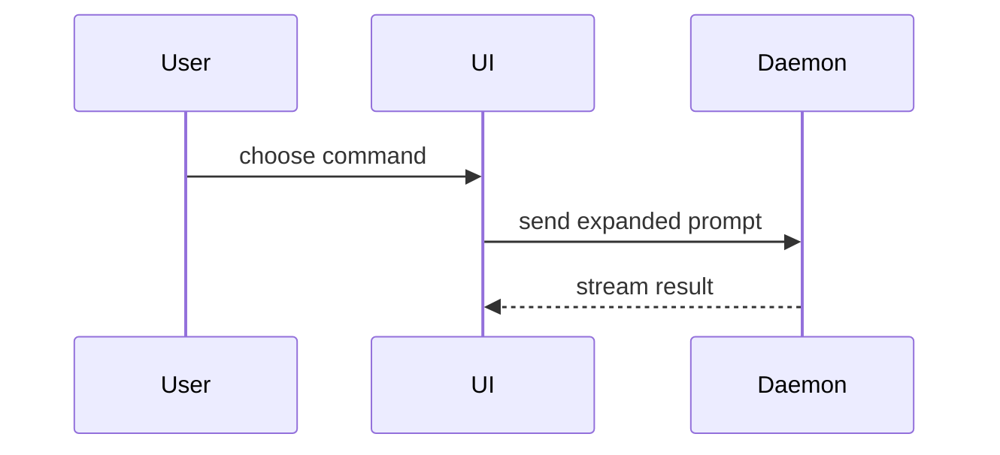

Format the requested PR description. Read the final diff, relevant issue or contract, repository PR template, and available validation evidence. Use the existing template when required; otherwise choose the smallest useful structure. Lead with the concrete problem and resulting behavior. A small change may need only one or two sentences and validation. This skill does not create, publish, merge, or otherwise mutate a PR; those actions require their own authorization.

For a change with enough substance to benefit from separate sections, adapt this template:

```markdown
## Summary

<concrete problem and resulting behavior; optional useful visual>

## Evidence

- <actual verification command and observed result>
- <before/after evidence only when both were observed>

## Risk and rollback

<material affected behavior, relevant limitation, and practical rollback; omit if unnecessary>
```

## Sections

Keep prose brief and use the owning glossary, whether `GLOSSARY.md`, `CONTEXT.md`, or another documented owner. Follow the repository and user's language conventions. Describe the final candidate rather than abandoned approaches or conversation history.

### Summary

Start with the problem and outcome. Include a visual only when it explains ownership, flow, or behavior more clearly than a short paragraph. The following options are available, not required:

- Show logic or an algorithm as pseudocode:

```text
on(save)
  if content is unchanged
    return cached result
  write new content
  return fresh result
```

- Show runtime control flow as a call tree:

```text
submitForm
  createSession
    persistPrompt
    launchAgent
  navigateToSession
```

- Show UI structure as a component tree, including state and module boundaries that matter:

```text
<SessionPage> (apps/example/src/routes/session.tsx)
  useSessionEvents()
  <SessionToolbar>
    <RunSkillButton> (packages/ui)
```

- Show file responsibility or a broad refactor as a shallow file tree:

```text
src/
├── commands/       # parses user actions
├── sessions/       # owns session state
└── transport/      # sends API requests
```

- Show component interaction, control flow, or data flow with Mermaid:



- Use `diff` when the point is what changes and the surrounding shape already exists. Match the diff shape to the topic.

For a component change:

```diff
 <SessionPage>
   useSessionEvents()
   <SessionToolbar>
+    <RunSkillButton />
   <SessionTimeline>
+    <SkillResultCard />
```

For a file-layout change:

```diff
 src/
 ├── commands/
+│   └── show-me.ts       # expands the slash command
 ├── sessions/
-└── transport.ts
+└── transport/
+    ├── client.ts
+    └── stream.ts
```

For a call-tree or call-stack change:

```diff
 submitForm
   createSession
     persistPrompt
+    expandSkillMention
     launchAgent
-  navigateToSession
+  navigateToSession
+    subscribeToEvents
```

For a state or control-flow change:

```diff
 on(save)
-  write content
+  if content is unchanged
+    return cached result
+  write new content
+  invalidate cache
```

- Show the whole block when most of it is new, when omitted context would hide ownership or order, or when the user needs a copyable target shape:

```ts
function expandSkill(command: string): string {
  const skillName = command.slice(1);
  return `use the ${skillName} skill`;
}
```

#### Guidance

Place each visual next to the short text it supports. Keep only the calls, files, props, states, and boundaries needed to answer the user's current question or the options to resolve the current discussion point.

You may use one of these, you may use several, it is unlikely you will use all of them. Use your judgement and don't overwhelm the user.

### Evidence

Report concrete evidence actually observed: relevant test commands and results, output, or screenshots for visual changes. Include before and after only when both were captured; do not infer a failing baseline from a passing candidate. Label illustrative pseudocode as illustrative, never as a test result.

Separate local checks, deployment, provider delivery, and human acceptance. State an unrun check or relevant limitation briefly. Do not run broad tests or create screenshots solely to fill the template; follow the owning task's verification requirements.

### Risk and rollback

Describe concrete material impact and practical reversal when relevant. A code revert may not reverse a schema migration, data loss, external delivery, or already executed operation. Mention those consequences only when present in the actual change. Keep routine descriptions proportionate rather than inventing a risk checklist for every PR.

The optional "one-way/two-way door" metaphor can help explain reversibility, but concrete affected users, consumers, data, or interfaces are more informative than one-word labels.

### Completion

Check the body against the final diff and observed evidence, obey the repository template, and deliver the requested text or update the authorized owning draft. See [CREDITS.md](CREDITS.md) for attribution of the visual menu.
